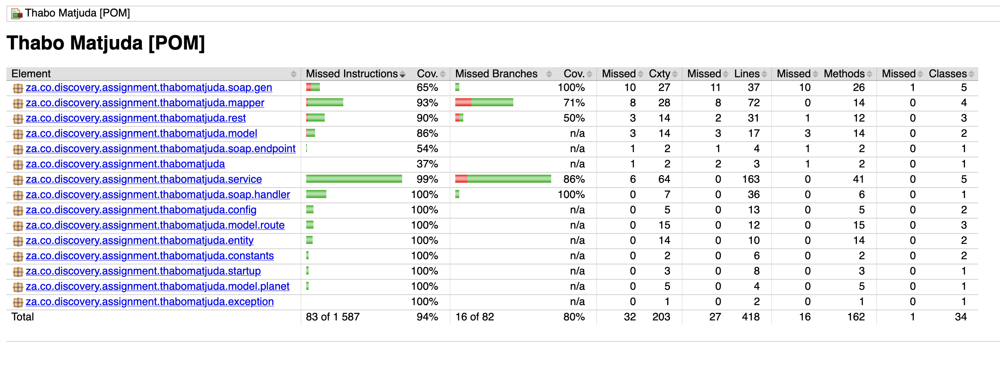

# Interstellar Travel System Service

The above graph represents an interstellar transport system used by Earth’s inhabitants in the year 2145.

They require you to build a system that will allow them to find the shortest path from point “A”, being Earth, through the galaxy to any of the planets represented by the other nodes.

You are provided with a list of node names and their respective distances between their linked planets and things.

In addition, you need to ensure that the system will work from any source to destination coordinates specified.

 

 

## Tech Stack

The technology stack used in the project is :

* **Java** (JDK 17.x )
* Maven 3.8.7
* Spring Boot 2.7.17 (with Spring 5.3.30)
* JPA Specification 2.2.3 (supported by the Hibernate Implementation 5.6.15)
* Apache Derby Database ( In-Memory )
* Project Lombok
* MapStruct ( for Model / DTO mapping )
* REST Web Service ( with Spring MVC, JSON, Swagger UI)
* JUNit 5
* Mockito
* JaCoco ( Java Code Coverage )
* Apache Commons ( for Text, Collections utilities )
* Apache POI ( for MS Excel Sheet Processing )
* Dijkstra's algorithm ( for the shorted path calculation )

 

## Setting Up

Given the technology stack mantioned above you will mainly need Java 17 installed on your machine.

You can use the maven included in the repo with via the supllied scipts for both Windows OS (`mvnw.cmd`) and Unix OS (`mvnw`)based machines.

1. To build the project change to the root directory and use the command `./mvnw clean install` to build
2. When the build is done you can run the service using `./mvnw spring-boot:run`

 

## Service Info

This application has two Web Services. A REST & SOAP type.

To access or use these APIs please see the follwing information :

* **REST** : This is for managing the Planets & Routes Entities, with the base path at : `http://localhost:8003/interstellar/rest`

There's a Postman collection for both Web Service types in the `src/test/resources` where the filename is : `Shortest Path API.postman_collection.json`

Importing that file will give more context on the Web Services and to test the Web Services.

 

## Test Coverage

As mentioned above I am using JaCoCo for test coverage. The service is curretnly sitting at **94%** coverage

After bulding the app with tests you can find the report in : `target/site/index.html`. This will be coverage

The image below has been attached in the folder ${roo}/assets/jacoco-test-coverage-report.png

Open that in using your preferred browser.

 

